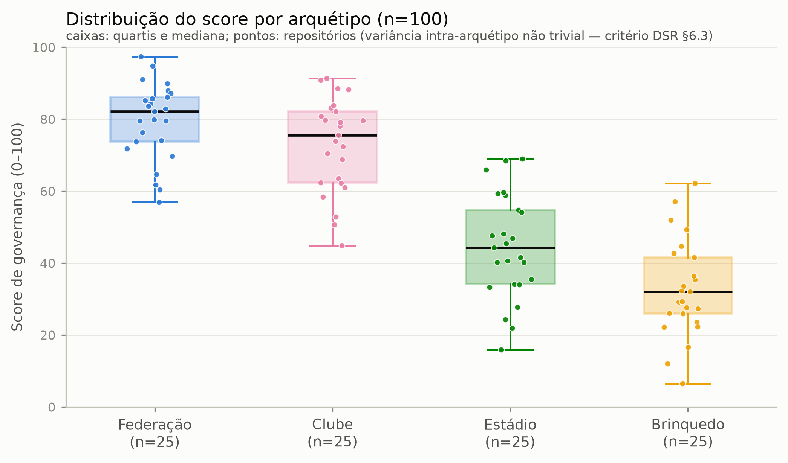

# oss-governance-score

Algoritmo para identificação de padrões de boas práticas de governança em
projetos de software open source — código de pesquisa do TCC (MBA em Gestão
Estratégica de Operações, Projetos e TI, USP/EACH). Implementa as Etapas 2
(criação do algoritmo) e 3 (validação) do método.

```
extract (APIs GitHub / git) → score (normalização + agregação) → validate (Spearman)
```

## Resultados em uma olhada

Amostra estratificada de **n=100 repositórios** (25 por arquétipo de
Asparouhova, 2020), extração em 23–24/07/2026:



| | |
|---|---|
| Score por arquétipo (mediana) | Federação 77,1 · Clube 75,3 · Estádio 41,7 · Brinquedo 32,0 |
| Sensibilidade dos pesos | ranking estável: ρ ≥ 0,935 em todas as variantes (iguais, ±25%, LODO) |
| Validação externa (Holm) | OpenSSF Scorecard ρ=0,750 (n=53) · forks 0,454 · stars 0,403 — p aj. < 0,001 |

Relatórios completos em [`results/`](results/) — QA da extração,
sensibilidade e validação — e figuras (PNG+PDF) em [`figures/`](figures/).
Rascunho das seções 4.2/4.3 em
[`docs/rascunho_secoes_4.2_4.3.md`](docs/rascunho_secoes_4.2_4.3.md).

## As cinco dimensões

Catálogo completo com limiares e pesos em
[`config/metrics.yaml`](config/metrics.yaml); mudanças pós-piloto têm
registro de decisão em [`docs/decisions/`](docs/decisions/).

- **D1** Artefatos de governança (README, CONTRIBUTING, CoC, licença,
  templates, CODEOWNERS, GOVERNANCE, FUNDING) — peso 0,25
- **D2** Distribuição das contribuições (top-1, HHI, truck factor) — 0,25
- **D3** Responsividade (1ª resposta em issues — CHAOSS —, merge de PRs,
  cobertura de revisão) — 0,20
- **D4** Diversidade (contribuidores ativos, entropia, elephant factor,
  retenção) — 0,15
- **D5** Segurança (SECURITY.md, CI, automação de dependências, releases) — 0,15

Métricas faltantes são omitidas da média (nunca imputadas como zero), com
pesos renormalizados sobre as dimensões disponíveis.

## Reprodução

Ambiente Python sempre via [`uv`](https://docs.astral.sh/uv/):

```bash
uv venv && uv pip install -r requirements.txt
make test                                   # 223 testes unitários
export GITHUB_TOKEN=$(gh auth token)        # ou um PAT (leitura pública)
```

Pipeline completo, na ordem do método:

```bash
PYTHONPATH=src uv run python -m govscore.cli pilot --backend both   # 4 pilotos
PYTHONPATH=src uv run python -m govscore.cli sample       # amostragem n=100 → config/sample_full.yaml
PYTHONPATH=src uv run python -m govscore.cli run          # extração completa → data/processed/ + QA
PYTHONPATH=src uv run python -m govscore.cli sensitivity  # pesos → results/sensibilidade.md
PYTHONPATH=src uv run python -m govscore.cli validate     # externos → results/validacao.md
make figures                                              # figuras + results/tabelas_tcc.md
```

Catálogo v2 (reparo da medição de D1/D5 na época do snapshot — decisão de
13/09/2026): `make repair` executa `epoch` (commit/árvore first-parent por
repositório, só git) → `rescore` → `compare` (`results/reparo_v1_v2.md`) →
`locus-evidence` → `validate --offline` → `sensitivity` → `robustness` →
figuras. As saídas v1 ficam em `data/processed/v1/`, `results/v1/` e
`figures/v1/`. `scripts/scorecard_cli_run.py` + `scorecard-cli-report` geram a
validação secundária com o Scorecard CLI nos 100 (`results/scorecard_cli.md`).

Notas de execução:

- **`run` é retomável de qualquer ponto**: cada repositório concluído é
  gravado em um JSONL de progresso; quedas de rede/máquina retomam do último
  repo completo (`--fresh` força reextração). Duração típica: 1–3 h
  (dominada pelos clones rasos das Federações).
- **Cache primeiro**: toda resposta de API é persistida em `data/raw/`
  (fora do versionamento) antes de qualquer processamento; a análise nunca
  reconsulta a plataforma. Só respostas definitivas entram no cache —
  falhas transitórias jamais são gravadas. Única exceção registrada: os
  objetos do catálogo v2 (`data/raw/<repo>/v2/`) são commits e árvores
  IMUTÁVEIS por SHA obtidos via git em 09/2026 — as chaves v1 nunca são
  reconsultadas nem sobrescritas.
- Sem token, apenas o backend git funciona
  (`pilot --backend git` — D1/D2/D4 e parte de D5).

## Estrutura

```
config/metrics.yaml        catálogo: dimensões, limiares ABSOLUTOS e pesos (congelado pós-piloto)
config/sampling.yaml       parâmetros da amostragem (limiares §3.1, exclusões, quotas)
config/sample_full.yaml    amostra n=100 gerada + 406 casos ambíguos p/ inspeção manual
docs/decisions/            registros de decisão de mudanças no catálogo
docs/rascunho_*.md         rascunho das seções 4.2/4.3 da monografia
src/govscore/              cliente (REST+GraphQL, cache, retry), extração (api/git/both),
                           amostragem, scoring, sensibilidade, validação, figuras
data/raw/                  cache bruto por repositório (não versionado)
data/processed/            full_metrics.json, metrics.parquet, scores.csv
results/                   qa_extracao.md, sensibilidade.md, validacao.md, tabelas_tcc.md
figures/                   7 figuras em PNG (300 dpi) + PDF vetorial
tests/                     60 testes das funções de cálculo (casos conhecidos)
```

## Reprodutibilidade e ética

- Snapshot temporal registrado por repositório (`extracted_at`); o relatório
  de QA da extração carimba o hash do código (com sufixo `-dirty` se houver
  mudanças não commitadas).
- Os artefatos processados contêm **apenas agregados** — nenhum login ou
  e-mail de contribuidor é publicado.
- Limiares de normalização são decisões de pesquisa ancoradas na literatura
  (CHAOSS; Coelho & Valente, 2017; Avelino et al., 2016) e não são ajustados
  a posteriori; a robustez da ponderação é verificada por análise de
  sensibilidade.
- Cuidado metodológico central: a presença de artefatos de governança **não**
  é critério de inclusão amostral (é parte da variável dependente).

## Licença

[Apache-2.0](LICENSE). Se este código ou dataset for útil na sua pesquisa,
cite o TCC (referência completa após a publicação).
